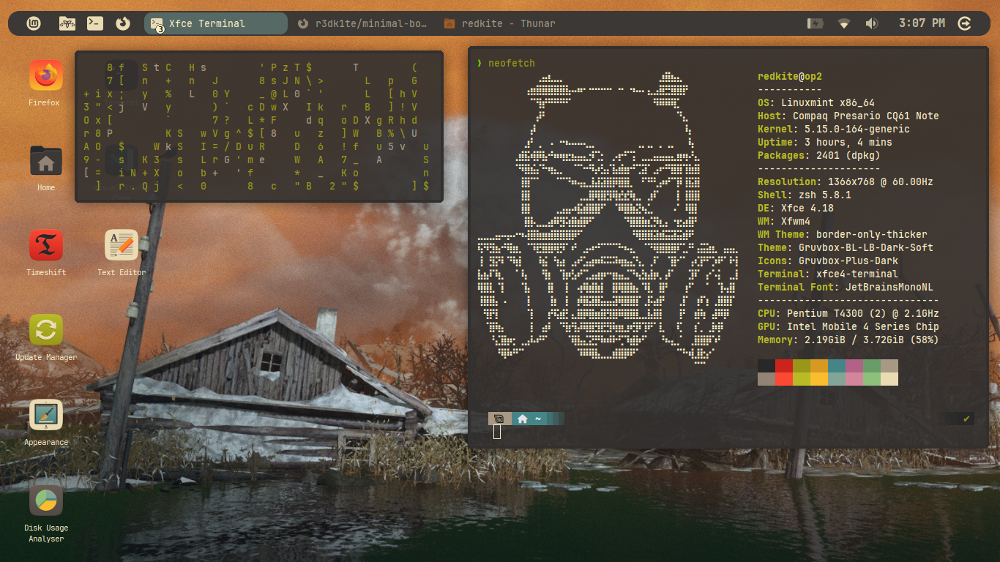
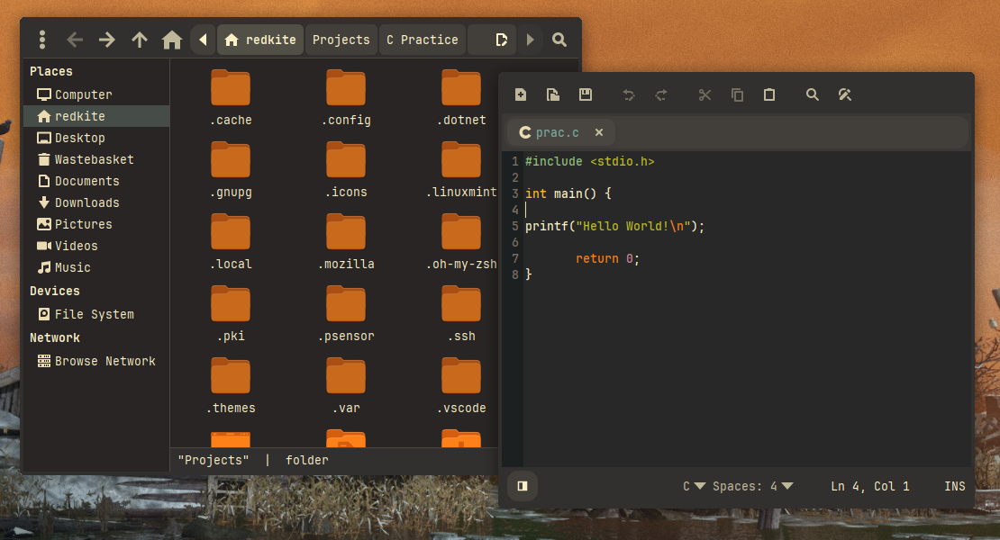

# Minimal Border Only Thick

A minimalist XFWM4 window theme with **double-thickness borders**, **rounded corners**, and a subtle **Gruvbox Material** color palette.

## Screenshots 





## Overview

This is an enhanced version of the original [Border Only](https://www.xfce-look.org/p/1016214/) theme for XFCE. It features:

- **4px borders** (doubled from original 2px) for better resize grip
- **Uniform border thickness** across all sides including title bar
- **Rounded corners** on all 4 corners with smooth diagonal transitions
- **Gruvbox Material soft dark color** (#32302f) for a modern, warm aesthetic
- **Transparent appearance** while maintaining full window interaction functionality

## Features

✓ Thicker, more manageable window borders  
✓ Rounded corners on all 4 corners  
✓ Uniform styling across active and inactive windows  
✓ Move window from any border or title bar  
✓ Resize from left, right, bottom borders and all 4 corners  
✓ Subtle Gruvbox Material color scheme  
✓ Minimal, distraction-free design  

## Installation

### For Linux Mint XFCE and other XFCE-based distributions:

1. **Copy the theme to your themes directory:**
   ```bash
   cp -r minimal-border-only-thick ~/.themes/
   ```

2. **Apply the theme:**
   - Open **Settings Manager**
   - Navigate to **Appearance** → **Window Manager**
   - Select **minimal-border-only-thick** from the list
   - Click **Close**

3. **Verify the changes:**
   Open any window and you should see:
   - Thick uniform borders on all sides
   - Smooth rounded corners
   - Soft dark Gruvbox Material color

## Color Palette

| Element | Color | Hex Code |
|---------|-------|----------|
| Border (Active) | Gruvbox Material Soft Dark | `#32302f` |
| Border (Inactive) | Gruvbox Material Soft Dark | `#32302f` |
| Transparency Areas | Transparent | `none` |

The `#32302f` color is warm, subtle, and pairs well with most desktop backgrounds while maintaining excellent visibility for window interaction.

## Modifications from Original Theme

### 1. Border Thickness (2px → 4px)

**Files modified:**
- `xfwm4/left-active.xpm`
- `xfwm4/left-inactive.xpm`
- `xfwm4/right-active.xpm`
- `xfwm4/right-inactive.xpm`
- `xfwm4/bottom-active.xpm`
- `xfwm4/bottom-inactive.xpm`

**Change:** Increased width/height from 2 pixels to 4 pixels to provide better resize grip area.

### 2. Title Bar Thickness (1px → 4px)

**Files modified:**
- `xfwm4/title-1-active.xpm` through `title-5-active.xpm`
- `xfwm4/title-1-inactive.xpm` through `title-5-inactive.xpm`

**Change:** Extended title bar from 1px to 4px height to match the border thickness and create visual consistency.

### 3. Rounded Corners

**Files modified:**
- `xfwm4/top-left-active.xpm`
- `xfwm4/top-left-inactive.xpm`
- `xfwm4/top-right-active.xpm`
- `xfwm4/top-right-inactive.xpm`
- `xfwm4/bottom-left-active.xpm`
- `xfwm4/bottom-left-inactive.xpm`
- `xfwm4/bottom-right-active.xpm`
- `xfwm4/bottom-right-inactive.xpm`

**Change:** Implemented diagonal transparency pattern to create rounded corner effect. Each corner is 4x4 pixels with a diagonal fade pattern:

```
Top-left example:
...#
..##
.###
####
(. = transparent, # = border color)
```

### 4. Color Updates

**All border and title files:** Changed color from black/dark grays to Gruvbox Material soft dark `#32302f`.

This warm, neutral color provides:
- Better contrast with light backgrounds
- Subtle appearance that doesn't dominate the screen
- Consistency with Gruvbox Material color schemes

## File Structure

```
minimal-border-only-thick/
└── xfwm4/
    ├── bottom-active.xpm
    ├── bottom-inactive.xpm
    ├── bottom-left-active.xpm
    ├── bottom-left-inactive.xpm
    ├── bottom-right-active.xpm
    ├── bottom-right-inactive.xpm
    ├── left-active.xpm
    ├── left-inactive.xpm
    ├── right-active.xpm
    ├── right-inactive.xpm
    ├── themerc
    ├── title-1-active.xpm
    ├── title-1-inactive.xpm
    ├── title-2-active.xpm
    ├── title-2-inactive.xpm
    ├── title-3-active.xpm
    ├── title-3-inactive.xpm
    ├── title-4-active.xpm
    ├── title-4-inactive.xpm
    ├── title-5-active.xpm
    ├── title-5-inactive.xpm
    ├── top-left-active.xpm
    ├── top-left-inactive.xpm
    ├── top-right-active.xpm
    └── top-right-inactive.xpm
```

## Technical Details

### XPM Format

All window decorations are defined in XPM (X PixMap) format—a text-based image format ideal for small graphics.

**Basic structure:**
```xpm
/* XPM */
static char * filename = {
"width height colors_used chars_per_pixel",
"char_code color_definition",
"pixel_row_as_string",
...
};
```

### Border Files

- **Side borders** (left, right): 4×1 pixel dimensions
- **Top/bottom borders**: 1×4 pixel dimensions
- **Corners**: 4×4 pixel dimensions with gradient transparency

### Title Bar Configuration

The `themerc` file contains XFCE window manager settings:

```
full_width_title=true
title_vertical_offset_active=-25
title_vertical_offset_inactive=-25
```

These settings ensure the title area spans the full window width and positions text correctly.

## Customization

To customize this theme further:

1. **Change the color:** Edit all `.xpm` files and replace `#32302f` with your preferred hex color
2. **Adjust border thickness:** Modify the pixel dimensions (e.g., change "4" to "6" for even thicker borders)
3. **Modify rounding:** Adjust the transparency pattern in corner files for more/less rounded effect

After editing, reload the theme in Settings Manager by selecting a different theme and then switching back.

## Compatibility

- **XFCE 4.12+** (includes XFWM4 4.12 and later)
- **Linux Mint XFCE Edition** (all versions using XFWM4)
- Any XFCE-based distribution

## Original Theme

This theme is based on the excellent [Border Only (Thicker)](https://www.xfce-look.org/p/1016214/) theme.

**Original author:** Border Only theme creators  
**Modifications:** Enhanced version with thicker borders, rounded corners, and Gruvbox Material color  
**License:** Same as original (typically GPL)

## Troubleshooting

### Theme not loading?
- Ensure the theme is in `~/.themes/minimal-border-only-thick/xfwm4/`
- Restart XFWM4: Right-click desktop → Window Manager → **Restart**

### Borders look different than expected?
- Check that the theme is actually selected in Settings Manager
- Your desktop background or GTK theme may affect perception of colors
- Some compositors may affect border rendering

### Window interaction issues?
- If resizing doesn't work: Ensure all XPM files are properly formatted
- If colors look wrong: Verify the hex color code `#32302f` is correctly spelled in all files

## Support

For issues or questions about this theme:
1. Check the [original theme page](https://www.xfce-look.org/p/1016214/)
2. Review XFCE documentation on window themes
3. Test with a fresh XFCE installation to isolate theme issues

## License

This modified theme retains the same license as the original Border Only theme. Check the original source for specific licensing information.

---

**Version:** 1.0  
**Last Updated:** January 2026  
**Theme Name:** minimal-border-only-thick
